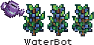

  

# WaterBot

**WaterBot** is a [Stardew Valley](https://www.stardewvalley.net/) mod that helps you water your crops while staying as vanilla as possible.

When you **right-click** a plant with your **Watering Can**, the bot will take control of your character, **watering all your crops** and **refilling the water** can at the nearest water source whenever necessary.

**Left-click** at any point to stop the bot. The bot will automatically stop if you have low stamina.

# Contents

- [Install]()
- [Configure]()
- [Compatibility]()
- [Implementation]()

# Install

1. Install the latest version of [SMAPI](https://smapi.io/).
2. Download this mod and unzip the contents.
3. Place the mod in your Mods folder.
4. Run the game using SMAPI.

# Configure

# Compatibility

# Implementation

### 1. Trigger

To begin the mod listens for whenever the player `right-clicks`. If the player is clicking a crop with their watering can, the bot starts.

### 2. Loading the Players Farm

The bot first looks through the farm map data, going tile by tile and marking the following traits:

| Trait     | Description                                         |
|-----------|-----------------------------------------------------|
| Waterable | Does the tile need to be watered                    |
| Block     | Does the tile allow the player to walk on top of it |
| Water     | Can the player refill the Watering Can here         |

All the tiles are placed in a 2D array. Any waterable crops are also placed in their own array.

  

For the image above, the tiles are colors accordingly:

| Color      | Waterable | Block | Water |
|------------|-----------|-------|-------|
| Green      | True      | False | False |
| Dark Green | True      | True  | False |
| Turquoise  | False     | True  | True  |
| Dark Blue  | False     | False | True  |
| Red        | False     | True  | False |

### 3. Find Grouped Crops

Tiles with crops that need watering are then grouped based on adjacency using depth first search.

  

### 4. Cost of Traveling Between Groups

The both then uses A* pathfinding to determine the cost of traveling from one group to another.

The algorithm starts at the tile closest to the centroid of each grouping.

The cost of traveling to each group is also done from the players current perspective.

  

This then gives us a nice cost matrix!

|        | Player | Purple | Yellow | Blue |
|--------|--------|--------|--------|------|
| Player | -1     | 11     | 5      | 5    |
| Purple | 11     | -1     | 6      | 8    |
| Yellow | 5      | 6      | -1     | 6    |
| Blue   | 5      | 8      | 6      | -1   |

At this point any unreachable groups are disgarded.

### 5. The Travelling Water Man

We need to find the shortest path through all the groups, starting at the players current position.

The bot runs a greedy approach to solving the travelling salesman problem.

The starting point is the player's position, and the shortest path through all the groups is search for.

### 6. Watering the Group

For each group, depth first search is applied to fill in the tiles.

At each tile, all adjacent (now include diagonals) are watered as well. This means we can skip walking to every block and simply water anything around us.

If a block cannot be stood on, the bot chooses the next best option and waters it from there.

  

### 7. Out of Water!

When the watering can is low, the bot will go to the nearest source of water to refill.

The closest refillable spot is found using breadth-first-search from the players position.

Once the spot is found, the bot navigates the player to the closest spot to the water, refills, then returns to watering.

  

